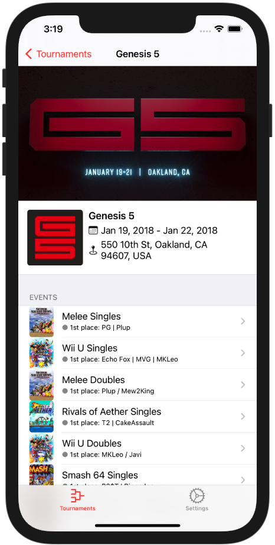

# pocket.gg

An upcoming iOS mobile client for the [smash.gg](https://smash.gg/) website, written in Swift

## Features
- [ ] General
    - [x] View a list of tournaments registered on smash.gg
    - [x] Choose which tournaments appear based on which video games they feature
    - [x] Ability to only show featured tournaments, and/or upcoming tournaments
    - [ ] Search for any tournament by name
- [ ] Tournament Details
    - [x] Name, Date & Location
    - [x] Events & Video Games
        - [x] Standings for each event
        - [ ] Brackets for each event
        - [ ] Shortcuts to the event's live streams 

## Screenshots

&nbsp;

&nbsp;

&nbsp;

&nbsp;

