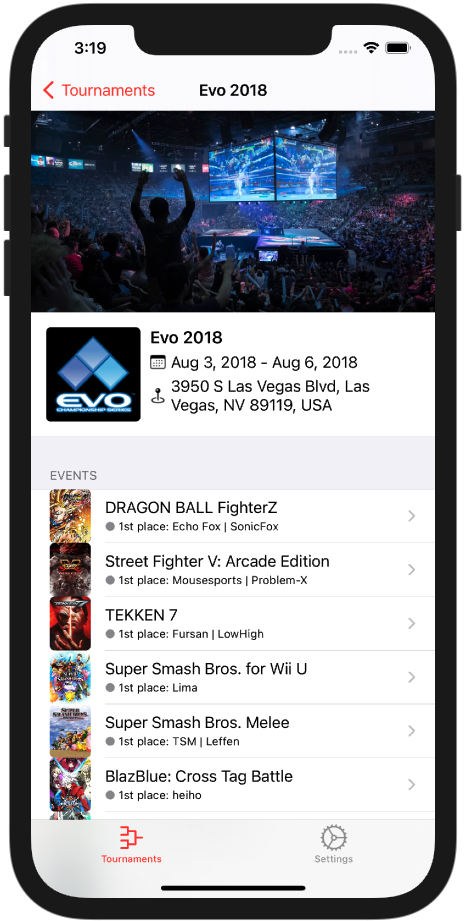
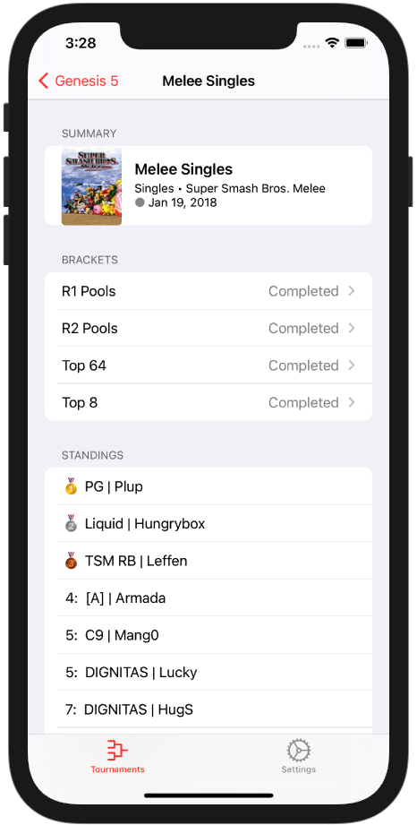
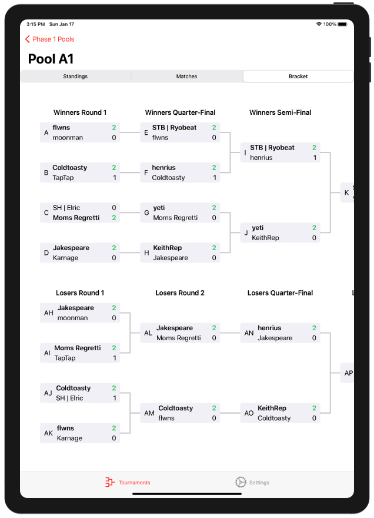

# pocket.gg

An upcoming iOS mobile client for the [smash.gg](https://smash.gg/) website, written in Swift

## Features
- [ ] General
    - [x] View a list of tournaments registered on smash.gg
    - [x] Choose which tournaments appear based on their featured video games
    - [x] Ability to only show featured tournaments, and/or upcoming tournaments
    - [ ] Search for any tournament by name
- [x] Tournament Details
    - [x] Name, Date & Location
    - [x] Events & Video Games
        - [x] Standings for each event
        - [x] Brackets for each event
        - [x] Shortcuts to the event's live streams 

## Screenshots

&nbsp;

&nbsp;

&nbsp;

&nbsp;

&nbsp;

&nbsp;

